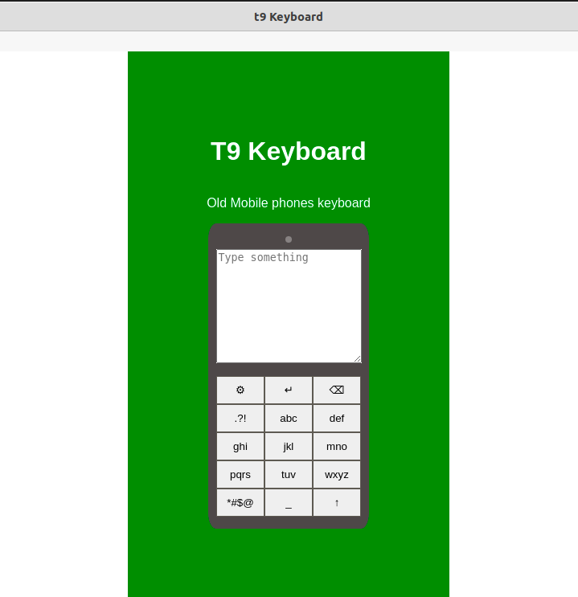

# t9 (old) Keyboard
Made using react and electronjs

# Available Scripts

In the project directory, you can run:

`npm start`

Runs the app in the development mode.\
Open [http://localhost:3000](http://localhost:3000) to view it in the browser.

Then you can run

`npm run electron`

to use this app

## Screenshot

